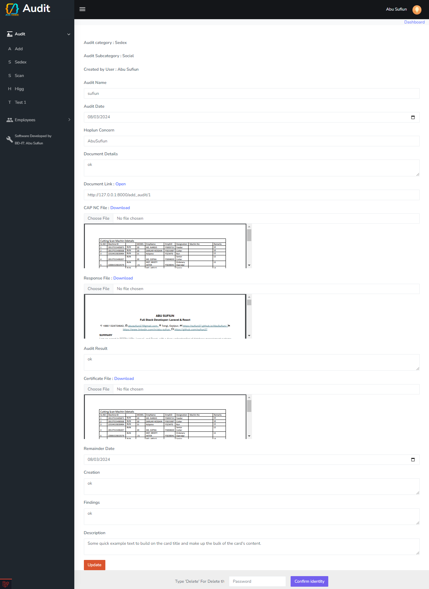

# Audit Management System

This project is built using Laravel and provides a comprehensive solution for managing audit documents.

## Features

- Manage audits across different departments with user-specific permissions.
- Create and organize multiple audit categories, subcategories, and audit items.
- Dynamically manage audit categories, subcategories, and their related items.
- Upload and modify necessary files for each audit item.
- Receive dashboard notifications for upcoming audits based on expiration dates, with alerts for the nearest ones.

## Screenshots

### Dashboard
- Displays notifications for upcoming audits.
  

### Audit Categories
- Add multiple audit categories and subcategories.
  

### Audit Items
- Add multiple audit items under a subcategory.

### Audit Item Details
- Upload multiple files and provide detailed information for each audit item.
  

### User Permission Management
- Add users and manage their roles and permissions.

